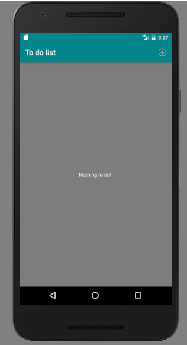
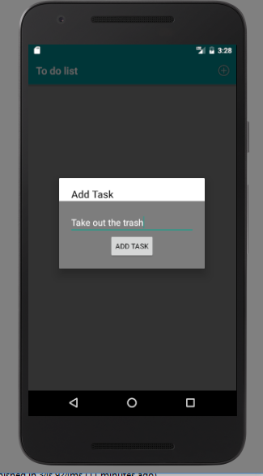
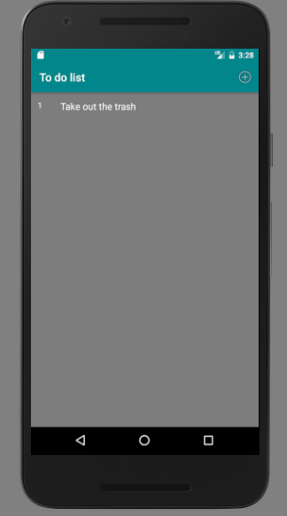
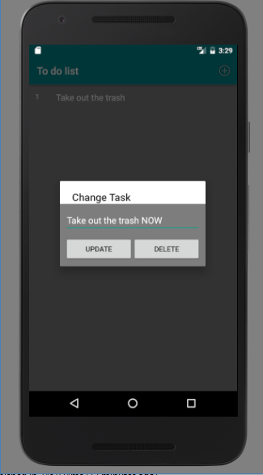
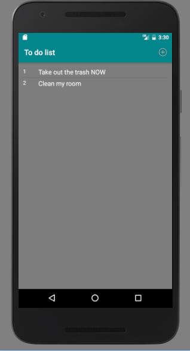

# Pim de Haan - pset 4

### Native App Studio
### Universiteit van Amsterdam
### Minor Programmeren
### 11425598
---

In this app the user is able to make his very own to do list.
The user is also able to change and delete these tasks.
The app also supports a landscape layout.

## Screenshots
---

